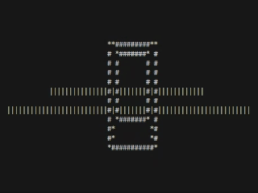
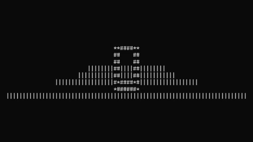

# CMD-3D Rough ASCII Renderer for Command Prompt

> **A real-time 3D wireframe cube renderer built specifically for Windows Command Prompt using pure ASCII characters**

Transform your command prompt into an interactive 3D graphics engine! This project demonstrates how to create real-time 3D rendering using nothing but ASCII characters, Python's standard library, and the Windows Command Prompt.


## Demo

| 3D Cube Rendering | Camera Movement |
|-------------------|-----------------|
|  |  |

*Real-time 3D wireframe cube rendering in Windows Command Prompt with free camera movement*

## Features

- **Real-time 3D rendering** in Windows Command Prompt using ASCII characters
- **Wireframe cube** with depth perception using `#` for edges and `*` for faces
- **Command prompt optimised** - designed specifically for CMD.EXE performance
- **Free camera movement** - walk around the cube in 3D space
- **Smooth rotation** - turn left/right with Q/E keys  
- **Grid floor** made of `|` characters for spatial reference
- **60 FPS rendering** with anti-flicker ANSI optimisation
- **No external dependencies** - uses only Python standard library and Windows `msvcrt`
- **Instant startup** - no installation required, just run the Python file

## Controls

| Key | Action |
|-----|--------|
| `W/S` | Move forward/backward |
| `A/D` | Strafe left/right |
| `Q/E` | Turn left/right |
| `Space` | Move up |
| `C` | Move down |
| `X` | Exit |

## Visual Elements

- **Cube edges**: `#` characters for wireframe outline
- **Cube faces**: `*` characters for depth connections
- **Floor grid**: `|` characters for spatial reference
- **Real-time info**: Position, rotation, and controls displayed

## Quick Start

### Prerequisites
- Python 3.7 or higher
- Windows Command Prompt (CMD.EXE)
- Windows OS (optimised for `msvcrt` keyboard handling)

### Installation

1. **Clone or Download**
   ```cmd
   git clone https://github.com/infinitumio/CMD-3D-ASCII-Renderer.git
   cd CMD-3D-ASCII-Renderer
   ```

2. **Run in Command Prompt**
   ```cmd
   python src\cmdASCIIRenderer.py
   ```

   Or use the convenient batch file:
   ```cmd
   start.bat
   ```

### Alternative: Direct Download
Download the `src\cmdASCIIRenderer.py` file and run it directly - no installation needed!

## How It Works

The renderer uses several key techniques:

1. **3D Vector Mathematics**: Full 3D coordinate system with Vector3 class
2. **Perspective Projection**: Converts 3D world coordinates to 2D screen space
3. **Camera Transformation**: Applies rotation and translation matrices
4. **Bresenham's Line Algorithm**: Draws smooth lines between 3D points
5. **Double Buffering**: Prevents flickering with optimised rendering
6. **ANSI Escape Sequences**: Smooth terminal control without screen clearing

## Technical Details

### Command Prompt Optimisation
- **ANSI Escape Sequences**: Uses `\033[H` for cursor positioning instead of `cls`
- **Windows MSVCRT**: Direct keyboard input via `msvcrt.kbhit()` and `msvcrt.getch()`
- **Cursor Management**: Hides cursor during rendering with `\033[?25l`
- **Buffer Rendering**: Pre-renders to character buffer for flicker-free display

### Architecture
- **SimpleRenderer**: Handles 3D-to-2D projection optimised for text display
- **Vector3**: 3D vector math operations for positions and rotations
- **Game Loop**: 60 FPS main loop designed for command prompt responsiveness
- **Multi-threading**: Separate input thread using Windows keyboard APIs

### Command Prompt Performance
- **60 FPS**: Achieves smooth 16.67ms frame time in CMD.EXE
- **Anti-flicker**: Eliminates screen flash using cursor positioning
- **Optimised ASCII**: Efficient character-based line drawing algorithms
- **Memory efficient**: Reuses character buffers to minimise allocations

### Platform Specifics
- **Primary**: Windows Command Prompt with `msvcrt` keyboard handling
- **Fallback**: Basic terminal support with `termios` (limited functionality)

## Project Structure

```
CMD-3D-ASCII-Renderer/
├── start.bat            # Main launcher - double-click to start!
├── README.md            # Project overview and quick start
├── screenshots/         # Demo GIFs and images
│   ├── demo1.gif        # 3D cube rendering demo
│   └── demo2.gif        # Camera movement demo
└── src/                 # Source code and documentation
    ├── cmdASCIIRenderer.py  # Main 3D renderer
    ├── README.md            # Complete technical documentation
    ├── setup.py             # System compatibility check
    ├── requirements.txt     # Dependencies (none needed!)
    ├── LICENSE              # MIT license
    ├── .gitignore          # Git ignore rules
    └── screenshots/        # Additional screenshots
```

## Customisation

You can easily modify the renderer:

### Change Cube Size
```python
size = 3.0  # Change from 2.0 to 3.0 for larger cube
```

### Modify Characters
```python
# In draw_simple_cube method
edges = [
    (0, 1, '█'), (1, 2, '█'), ...  # Use solid blocks
    (0, 4, '░'), (1, 5, '░'), ...  # Use light shade
]
```

### Adjust Movement Speed
```python
# In input_thread method
movement_speed = 0.3  # Change from 0.5 to 0.3 for slower movement
```

## Troubleshooting

**Screen flickering?**
- Maximise your terminal window
- Ensure terminal supports ANSI escape sequences
- Try running in different terminal (Windows Terminal, iTerm2, etc.)

**Controls not working?**
- Make sure terminal window has focus
- On some systems, try running with administrator privileges
- Check if terminal supports character input

**Performance issues?**
- Close other applications using terminal
- Try reducing frame rate by changing `time.sleep(1/60)` to `time.sleep(1/30)`

## Contributing

Contributions are welcome! Here are some ideas:

- Add more 3D shapes (pyramid, sphere, etc.)
- Implement face culling for better performance
- Add color support with ANSI color codes
- Create configuration file for settings
- Add mouse support for camera control

### Development Setup
1. Fork the repository
2. Create a feature branch
3. Make your changes
4. Test on multiple platforms
5. Submit a pull request

## License

This project is licensed under the MIT License - see the [LICENSE](LICENSE) file for details.

## Acknowledgments

- Inspired by classic ASCII art and retro terminal graphics
- Uses mathematical principles from computer graphics
- Built with love for terminal enthusiasts

## Star History

If you find this project useful, please give it a star! ⭐

---

**A Shkola Creation ❤️**

*Experience 3D graphics in your terminal!*
